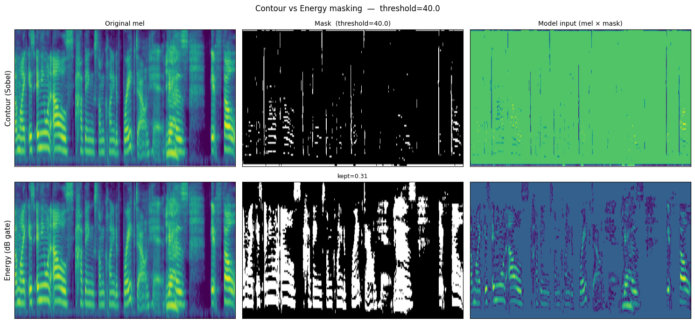
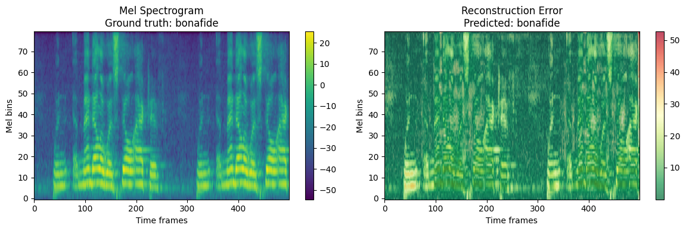
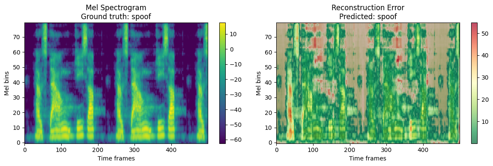

# Spectrogram Autoencoder for Deepfake Speech Detection

## Idea

Train an autoencoder **only on real speech**. At test time, use reconstruction error as the detection score — real speech reconstructs well, deepfakes don't.

```
Audio → Mel spectrogram → [mask] → Encoder → z → Decoder → Reconstruction
                                                                    ↓
                                              |mel − recon| → mean = score
                                              (higher = more likely fake)
```

No fake samples are needed during training. The detector is entirely unsupervised from the deepfake side.

---

## Masking

Before encoding, a binary mask is applied to focus the model on the most informative regions of the spectrogram rather than feeding it everything. We explored two strategies: a **contour mask** that uses Sobel edge detection to keep only pixels where energy changes rapidly (formant transitions, onsets), and an **energy mask** that keeps only the loudest regions by thresholding below a fixed dB offset from the spectrogram's peak.



---

## Models

Two encoder backbones were compared — a lightweight **CNN** autoencoder and a **ViT-Tiny** encoder paired with a shallow transformer decoder.

---

## Evaluation

Zero-shot evaluation across six datasets: ASVspoof 2019, ASVspoof 5, In The Wild, FakeXpose, MLAAD, and FamousFigures. The detector was never trained on any of these test conditions.

### Error maps

Each plot shows the original mel spectrogram (left) and the reconstruction error map overlaid on it (right). Red regions mark where the model struggled to reconstruct the signal.

For **bonafide speech**, the model has seen patterns like this during training and reconstructs them faithfully. The error map stays mostly cold with very little red.



For a **deepfake**, the synthetic spectral patterns are unfamiliar to the model. It fails to reconstruct them accurately and red regions spread across the error map. These are the anomalies the detector picks up.


